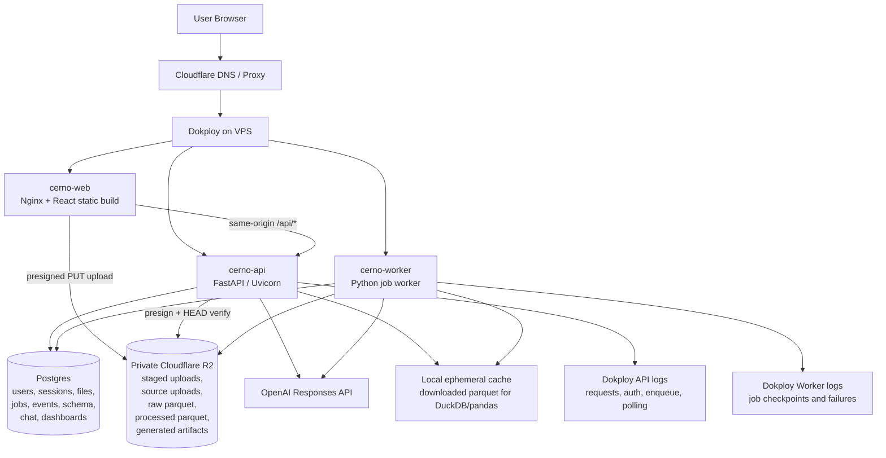
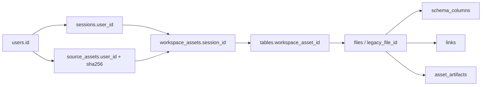
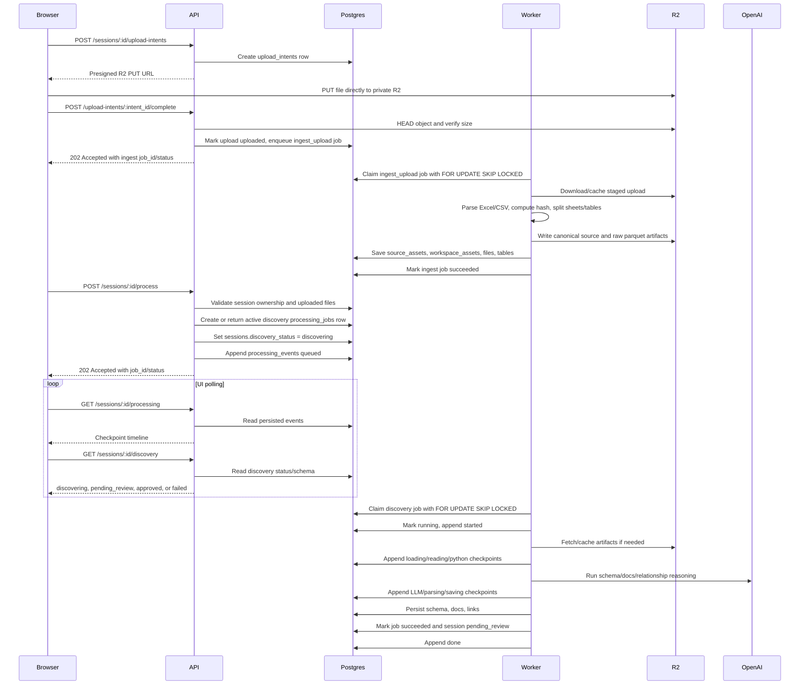

# Cerno Architecture

Last updated: 2026-05-06

This document captures Cerno's current architecture, the target production
architecture for long-running processing, and the implementation plan for
durable processing checkpoints.

## 1. Product And Runtime Shape

Cerno turns uploaded spreadsheet and CSV data into a reviewed data map, generated
insights, dashboard artifacts, and chat-driven analysis. The core product flow is:

1. User signs in with Google.
2. User creates or resumes a workspace/session.
3. User uploads one or more Excel/CSV files.
4. Cerno processes files to detect headers, file meaning, column meaning, and
   relationships.
5. User reviews and approves the data map.
6. Chat and generated visuals use the approved data map as their source of truth.

The production deployment should be split into three application services:

- `cerno-web`: static React app served by Nginx.
- `cerno-api`: FastAPI app for auth, CRUD, upload intents, R2 verification,
  polling, chat, and API orchestration.
- `cerno-worker`: background Python worker for durable long-running jobs.

Shared production dependencies:

- Postgres for application state, metadata, durable jobs, usage, and checkpoint
  events.
- Cloudflare R2 for uploaded source files and generated file/artifact blobs.
- OpenAI Responses API for schema discovery, relationship understanding, and
  chat/tool reasoning.
- Google OAuth for identity.
- Dokploy on the VPS for service deployment and logs.
- Cloudflare DNS/proxy in front of `cerno.nemukai.com`.

## 2. High-Level Architecture



The API should stay responsive. Expensive processing must not be tied to the
browser request. The worker should own long-running discovery work and write
progress into Postgres so progress survives refreshes, closed tabs, and normal
polling interruptions.

## 3. Storage Architecture

### Postgres

Postgres is the source of truth for application state and relationships between
objects. It should store metadata, status, and small structured payloads. It
should not store large uploaded files or generated binary artifacts.

Main existing tables and roles:

- `users`: Google identity, beta access status, profile metadata.
- `sessions`: user-owned workspace/session records and `discovery_status`.
- `upload_intents`: short-lived direct-to-R2 upload records created by the API,
  completed by the browser, and consumed by the worker.
- `files`: session-level uploaded/ingested table records; currently the legacy
  table record used by discovery, dashboard, and chat.
- `source_assets`: deduplicated uploaded source file metadata keyed by
  `(user_id, sha256)`.
- `workspace_assets`: link between a session and a source asset, allowing the
  same uploaded file to be reused by the same user in multiple workspaces.
- `asset_artifacts`: metadata for derived blobs such as raw parquet, processed
  parquet, and future generated artifacts.
- `tables`: normalized table/sheet records linked to workspace assets and legacy
  `files`.
- `schema_columns`: approved or discovered column metadata.
- `links`: discovered or user-added file relationships.
- `data_docs`: generated internal data guide: overview, file docs,
  relationships, glossary, usage notes, and starter questions.
- `dashboards`, `dashboard_pages`, `notebook_cells`: generated or user-edited
  dashboard/widget state.
- `chat_turns`, `chat_messages`, `chat_artifacts`: chat transcript, tool calls,
  assistant messages, and generated chat artifacts.
- `llm_usage`: daily per-user token usage accounting.
- `processing_events`: durable user-visible processing checkpoints.

Durable job additions:

- `processing_jobs`: queue rows for upload ingestion, discovery, and future
  async work.
- Extended `processing_events` fields for job-aware progress checkpoints.

### R2

R2 is a private durable object store for large file/blob payloads:

- Staged browser uploads written through presigned URLs.
- Original uploaded files.
- Raw parquet generated from uploads.
- Processed parquet with approved or normalized columns.
- Future generated chart exports, report files, PDF exports, or other artifacts.

R2 should be addressed through object keys stored in Postgres. Postgres keeps
ownership, upload intent, hash, type, and lifecycle metadata. R2 keeps the
actual bytes.

Browser uploads should not stream through FastAPI in production. The API creates
an upload intent and presigned URL, the browser uploads directly to R2, the API
verifies the object with `HEAD`, and the worker processes the object from R2.

### Local Cache

API and worker services can use local ephemeral disk as a cache for object-store
data needed by pandas, Polars, DuckDB, or Python tools.

The cache is not authoritative. If a cache file is missing, it should be fetched
or regenerated from R2/Postgres metadata.

## 4. User, Session, And File Isolation

Ownership must always flow through `users.id`.



Important rules:

- Every API route must validate that the current user owns the session or file.
- Deduplication should happen per user using content hash. This prevents
  cross-user leakage and still saves storage for repeated uploads by one user.
- A single source asset can appear in multiple workspaces through
  `workspace_assets`.
- Processing should operate on session-scoped file/table records, not directly
  on global source assets.
- Deleting a file from one workspace should not delete the source asset if
  another workspace still references it.

## 5. Durable Processing Architecture

### Why A Separate Worker

Processing includes file loading, header inference, Python profiling, LLM schema
generation, relationship discovery, and schema/doc persistence. This can take
longer than Cloudflare's normal request timeout. The browser may also refresh or
close while processing is running.

The API should enqueue work and return quickly. The worker should do the actual
processing from a durable database job. This avoids Cloudflare 524 errors and
keeps processing alive independently of the user page.

References:

- FastAPI background task docs recommend external workers for heavy background
  computation: https://fastapi.tiangolo.com/tutorial/background-tasks/
- Cloudflare 524 guidance recommends polling/status flows for long-running HTTP
  work: https://developers.cloudflare.com/support/troubleshooting/http-status-codes/cloudflare-5xx-errors/error-524/
- Postgres `SKIP LOCKED` supports queue-like row claiming:
  https://www.postgresql.org/docs/current/sql-select.html

### Processing Job Table

Add `processing_jobs`:

- `id TEXT PRIMARY KEY`
- `session_id TEXT NOT NULL REFERENCES sessions(id) ON DELETE CASCADE`
- `user_id TEXT NOT NULL REFERENCES users(id) ON DELETE CASCADE`
- `kind TEXT NOT NULL`
- `status TEXT NOT NULL`
- `attempts INTEGER NOT NULL DEFAULT 0`
- `locked_by TEXT`
- `locked_until TEXT`
- `heartbeat_at TEXT`
- `checkpoint_json TEXT NOT NULL DEFAULT '{}'`
- `idempotency_key TEXT NOT NULL UNIQUE`
- `started_at TEXT`
- `finished_at TEXT`
- `error_message TEXT`
- `created_at TEXT NOT NULL`
- `updated_at TEXT NOT NULL`

Initial job kinds:

- `ingest_upload`
- `discovery`

Initial statuses:

- `queued`
- `running`
- `succeeded`
- `failed`

Rules:

- Only one active `discovery` job per session.
- Upload completion creates one idempotent `ingest_upload` job per upload
  intent.
- If the user clicks process again while a job is `queued` or `running`, return
  the existing active job.
- Workers claim rows with `FOR UPDATE SKIP LOCKED` in Postgres.
- Workers extend `locked_until` through heartbeats so stale jobs can be safely
  reclaimed later.
- No automatic retries in v1. Retrying LLM-heavy jobs should be explicit to
  avoid duplicate token spend.
- A failed job should mark the session `discovery_status='failed'` and append a
  user-visible error event.

### Processing Events

`processing_events` remains the timeline that the UI polls. It should be
extended, while keeping old fields compatible:

- `job_id TEXT`
- `step_key TEXT`
- `level TEXT`
- `progress INTEGER`
- `details TEXT`

Checkpoint phases:

| Step key | Progress | Purpose |
| --- | ---: | --- |
| `queued` | 0 | API accepted the request and persisted the job. |
| `started` | 5 | Worker claimed the job. |
| `loading_artifacts` | 15 | Worker is caching/parquet-loading inputs. |
| `reading_files` | 25 | Worker is reading sample rows and table metadata. |
| `python_analysis` | 45 | Worker is profiling full files in Python. |
| `llm_schema` | 65 | Worker is asking the LLM for schema, docs, and relationships. |
| `parsing_response` | 75 | Worker is validating structured LLM output. |
| `saving_schema` | 85 | Worker is saving file, column, docs, and overview metadata. |
| `resolving_links` | 92 | Worker is merging deterministic relationship candidates. |
| `done` | 100 | Discovery is complete and ready for review. |
| `error` | 100 | Processing failed and needs user action. |

## 6. Upload And Processing Flow



API contract changes:

- `POST /sessions/{session_id}/upload-intents`
  - Returns R2 presigned PUT URLs.
  - The frontend uploads directly to R2, not through FastAPI.
- `POST /sessions/{session_id}/upload-intents/{intent_id}/complete`
  - API verifies the R2 object with `HEAD`.
  - API creates an idempotent `ingest_upload` job.
  - Response: `job_id`, `session_id`, `job_status`, `discovery_status`,
    `events`.
- `POST /sessions/{session_id}/process`
  - Returns quickly with `202 Accepted`.
  - Response: `job_id`, `session_id`, `job_status`, `discovery_status`,
    `events`.
  - Does not return final schema output.
- `GET /sessions/{session_id}/processing`
  - Returns persisted processing events.
  - Optionally includes active job status in a later response envelope.
- `GET /sessions/{session_id}/discovery`
  - Remains the final schema/data-map source.

Frontend rules:

- Treat upload completion as an ingest job, not as parsed file records.
- Poll processing events after upload until the worker has created file records.
- Treat `/process` as an enqueue call, not as final discovery.
- Keep showing progress while `discovery.status === "discovering"`.
- On page reload, if the loaded session is `discovering`, automatically resume
  polling.
- Only show generated schema/header/links when discovery is `pending_review` or
  `approved`.
- Show `failed` with the latest error event and a process-again action.

## 7. Worker Architecture

The worker should be a separate Python entrypoint, for example:

```bash
cerno-worker
```

Responsibilities:

- Open its own settings and Postgres connections.
- Poll for queued jobs.
- Claim one job at a time initially.
- Execute `run_discovery` with fresh repositories and a fresh LLM client.
- Append processing events after each phase.
- Emit clean structured logs.
- Mark jobs and sessions as succeeded or failed.

Postgres production claim strategy:

```sql
SELECT id
FROM processing_jobs
WHERE status = 'queued'
ORDER BY created_at
FOR UPDATE SKIP LOCKED
LIMIT 1;
```

SQLite/local development can use a simpler fallback claim because production
concurrency is Postgres-only.

Initial scaling:

- Run one worker replica.
- Keep job concurrency at one per worker process.
- Add multi-worker scaling later only after rate limits and LLM budget controls
  are explicit.

## 8. Chat Architecture

Current chat is synchronous:

- `POST /sessions/{session_id}/chat` runs inside the API.
- `run_chat_turn` loads processed parquet, registers DuckDB/Pandas tables,
  runs the LLM tool loop, persists messages, and optionally spawns dashboard
  widgets.

This can stay in the API for short interactive answers.

Future async chat should use the same worker infrastructure when a chat request
becomes long-running or close-resilient:

- deep analysis across large files
- multi-chart dashboard generation
- PDF/report/export generation
- long notebook/code execution
- any chat task that should keep running after refresh or browser close

Target future async chat flow:

1. API creates `chat_turn` with `state='pending'`.
2. API enqueues `processing_jobs.kind='chat_turn'`.
3. API returns `turn_id` immediately.
4. Worker runs the chat/tool loop.
5. Worker persists `chat_messages`, `chat_artifacts`, and final turn state.
6. UI polls turn/messages or subscribes to updates later.

Do not move all chat to the worker immediately. Keep normal chat synchronous
until latency, timeout, or close-resilience requirements force it.

## 9. Logging And Observability

Logs must be clean, searchable, and safe.

API logs should cover:

- auth/session ownership decisions
- upload received/completed
- process enqueue
- active-job reuse
- polling summary
- user-visible API errors

Worker logs should cover:

- job claimed
- checkpoint phase changes
- model calls
- artifact cache actions
- success/failure
- elapsed time and record counts

Use consistent key-value logs:

```text
event=processing.enqueue user_id=... session_id=... job_id=... file_count=...
event=processing.poll user_id=... session_id=... job_id=... status=running event_count=...
event=processing.checkpoint user_id=... session_id=... job_id=... phase=python_analysis progress=45 elapsed_ms=...
event=processing.complete user_id=... session_id=... job_id=... file_count=... link_count=... elapsed_ms=...
event=processing.failed user_id=... session_id=... job_id=... phase=llm_schema error="..."
```

Do not log:

- uploaded row samples
- full prompts
- raw LLM responses
- file contents
- OAuth secrets
- R2 credentials
- OpenAI keys

Add configuration:

- `CERNO_LOG_LEVEL=INFO`
- optional `CERNO_WORKER_ID`
- optional `CERNO_WORKER_POLL_INTERVAL_SECONDS`

## 10. Dokploy Deployment Shape

### cerno-web

- Build: `Dockerfile.web`
- Public service.
- Domain: `cerno.nemukai.com`
- Serves React static files.
- Frontend calls same-origin `/api/*`.

### cerno-api

- Build: `Dockerfile.api`
- Public API service behind `/api`.
- Command:

```bash
uvicorn cerno.main:app --host 0.0.0.0 --port 8765 --proxy-headers --forwarded-allow-ips '*'
```

- Required environment:
  - `CERNO_APP_ENV=production`
  - `CERNO_API_ROOT_PATH=/api`
  - `CERNO_FRONTEND_ORIGIN=https://cerno.nemukai.com`
  - `CERNO_POSTGRES_URL=...`
  - `CERNO_R2_*`
  - `CERNO_GOOGLE_CLIENT_ID`
  - `CERNO_GOOGLE_CLIENT_SECRET`
  - `CERNO_SESSION_SECRET`
  - `CERNO_LLM_API_KEY`

The R2 bucket must allow browser `PUT` uploads from
`https://cerno.nemukai.com` through its CORS policy. The bucket should remain
private; only presigned URLs should permit object writes.

### cerno-worker

- Build: `Dockerfile.worker`.
- Private service, no public domain needed.
- Default command:

```bash
cerno-worker
```

- Same environment as `cerno-api`.
- One replica initially.
- Logs checked separately in Dokploy worker service logs.

`Dockerfile.worker` intentionally mirrors the API image build, but uses
`CMD ["cerno-worker"]` instead of the API's Uvicorn command. This keeps the
worker service explicit in Dokploy and avoids relying on a command override.

## 11. Implementation Plan

1. Replace direct FastAPI multipart production uploads with direct-to-R2 upload
   intents.
2. Add Postgres and SQLite migrations for `upload_intents`, durable
   `processing_jobs`, and extended `processing_events`.
3. Add `ProcessingJob` model and repository methods:
   - create or get active job
   - claim next queued job
   - mark running/succeeded/failed
   - append checkpoint event
4. Add `cerno-worker` CLI entrypoint and worker loop.
5. Refactor discovery service to accept a checkpoint callback or event logger
   so every phase writes both DB events and structured logs.
6. Add API endpoints for upload intent creation and upload completion.
7. Add worker handling for `ingest_upload` jobs from staged R2 objects.
8. Change `POST /process` to enqueue discovery and return `202` with job
   metadata.
9. Change frontend upload and process handling to treat both as enqueue/poll
   flows.
10. Resume polling from persisted job events after page refresh.
11. Add clear UI handling for `queued`, `running`, `done`, and `error`.
12. Add Dokploy worker service using `Dockerfile.worker`.
13. Verify production logs and user-visible progress with a real upload.

## 12. Acceptance Criteria

- Browser uploads go directly to private R2 through presigned URLs.
- FastAPI does not receive production file bytes.
- Upload completion creates a durable ingest job.
- Clicking process returns quickly and never waits for LLM discovery.
- Cloudflare 524 no longer happens on processing.
- Progress checkpoints appear while processing is active.
- Refreshing or closing the browser does not stop processing.
- Reopening the session resumes progress polling from Postgres.
- Header detection and schema results appear only after processing completes.
- Dokploy API logs show user/session/job queue activity.
- Dokploy worker logs show exact processing phases and failures.
- A failed job marks the session failed and shows a useful UI error.
- Re-clicking process during an active job does not create duplicate LLM work.

## 13. Decisions Locked For V1

- Use direct-to-R2 browser upload for production uploads.
- Use a separate worker service for upload ingestion and discovery processing.
- Use Postgres as the job queue source of truth.
- Do not add Redis/Celery yet.
- Do not automatically retry failed LLM jobs yet.
- Run one worker replica initially.
- Keep normal chat synchronous in the API for now.
- Move only long-running or close-resilient chat/export/report tasks to the
  worker later.
