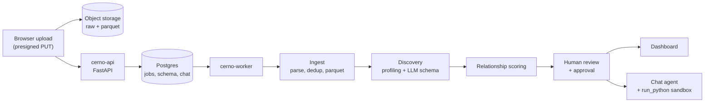

# Cerno

Cerno turns messy Excel and CSV uploads into a reviewed data map, a generated
dashboard, and chat-driven analysis that stays grounded in that map.

> **Status: archived (October 2026).** Cerno ran as a private beta with a small
> group of invited testers from May to August 2026. The hosted service has been
> shut down, all beta data has been deleted, and the code is published as-is
> for reference. It is not maintained and no hosted instance exists.

## What it did

1. **Sign in** with Google. Access was gated by beta codes and an email allowlist.
2. **Upload** one or more Excel or CSV files (plus optional PDF, text, or
   Markdown reference documents) into a workspace.
3. **Discover.** A background worker parses each file, finds the real header
   row, profiles every column over the full file, and asks an LLM to name
   files and columns, describe their meaning and grain, and propose
   relationships (join keys) between files.
4. **Review and approve.** The user edits and approves the resulting data map:
   file descriptions, column meanings, relationships, caveats, glossary terms,
   and starter questions.
5. **Analyze.** A generated dashboard and a chat agent answer questions. Every
   number is computed in a sandboxed Python step over the approved tables, and
   the agent can turn an answer into a new dashboard view.

The core idea: **the approved data map is the source of truth.** The model
never analyzes raw columns it has guessed about. A human confirms what the data
means first, and every later answer is built on that confirmation.

## How it works



- **Ingest** (`services/ingest.py`, `services/canonicalize.py`): reads Excel
  with calamine and CSV with dialect and encoding sniffing, deduplicates by
  content hash, and stores raw and canonical parquet.
- **Discovery** (`services/discovery.py`, `services/profiling.py`): full-file
  Python profiling feeds a structured-output LLM call that infers headers,
  friendly names, column semantics, and a data guide. Output is validated
  (`services/discovery_validation.py`) before it reaches the user.
- **Relationships** (`services/relationships.py`): candidate join keys are
  scored on weighted value containment, value rarity (IDF), name similarity,
  and type compatibility, so the LLM proposes links from evidence rather than
  from column names alone.
- **Anomalies** (`services/anomalies.py`): MAD outliers on numeric columns,
  rare categorical values, and orphaned keys across related files.
- **Chat** (`services/chat.py`, `services/tools.py`): an OpenAI Responses API
  tool loop with `list_tables`, `describe_table`, `read_schema_guide`,
  `run_python`, `render_widget`, and `search_regulations` (search over uploaded
  reference documents).
- **Sandbox** (`services/sandbox.py`): `run_python` executes in a child process
  with restricted builtins, a memory limit, and a timeout. Each approved file is
  exposed as a pandas DataFrame.
- **Worker** (`worker.py`): long-running processing is a durable job in
  Postgres with checkpoint events, so progress survives refreshes and restarts.

The design notes in [`Docs/Architecture.md`](Docs/Architecture.md) cover
storage layout, tenant isolation, the job and event tables, and the deployment
shape in more depth. [`Docs/Modules.md`](Docs/Modules.md) describes the client
module hook, and [`Design.md`](Design.md) the visual language.

## Stack

- **Backend:** Python 3.12, FastAPI, Uvicorn, psycopg (Postgres with pgvector),
  Polars, pandas, pyarrow, python-calamine, openpyxl, Authlib, boto3.
- **LLM:** OpenAI Responses API (separate models for discovery and chat).
- **Frontend:** React, TypeScript, Vite, Tailwind, ECharts, TanStack Query.
- **Storage:** Postgres for metadata, jobs, and chat; S3-compatible object
  storage (built against Cloudflare R2) for uploads and generated artifacts.
- **Tooling:** `uv` for Python, `bun` for the frontend, `ruff` and `mypy`.

## Running it locally

Cerno was built as a hosted service, so a local run needs real backing
services:

- Python 3.12, [`uv`](https://docs.astral.sh/uv/), and [`bun`](https://bun.sh)
- Postgres 16 with the `pgvector` extension
- An S3-compatible bucket (Cloudflare R2 was used in production)
- An OpenAI API key
- A Google OAuth client (redirect URI pointing at your local API)

```bash
# Install dependencies
uv sync --extra dev
cd frontend && bun install && cd ..

# Configure
cp .env.example .env.local
# Fill in Postgres, storage, OpenAI, and Google OAuth values.
# Put your own email in CERNO_SITE_OWNER_EMAILS.

# Run the API, the worker, and the frontend (three shells)
uv run cerno-server
uv run cerno-worker
cd frontend && bun run dev
```

Beta access is managed with the admin CLI:

```bash
uv run cerno-admin approve-email you@example.com
uv run cerno-admin create-code --max-uses 5 --expires-in 30d
```

## Tests and checks

```bash
uv run pytest                                  # unit tests
uv run pytest -m integration tests/integration # needs Docker (pgvector container)
uv run ruff check src
cd frontend && bun run typecheck && bun run build
```

## Repository layout

```text
src/cerno/
  api/          FastAPI routers: auth, sessions, chat, dashboards, orgs, owner
  services/     ingest, discovery, relationships, anomalies, chat, sandbox, tools
  providers/    LLM provider protocol and OpenAI implementation
  worker.py     durable background job runner
  admin.py      access-list and beta-code CLI
frontend/       React app (landing page, workspaces, review, dashboard, chat)
deploy/         Nginx config for the static frontend
tests/          unit tests, plus integration tests against real Postgres
Docs/           architecture and module notes
```

## Why it was shut down

Cerno worked, but it did not earn a place as a product:

- **The category got crowded fast.** General-purpose assistants and BI tools
  all shipped "upload a spreadsheet and ask questions" while Cerno was in beta.
  A horizontal tool needed a much sharper reason to exist.
- **Its best idea is a feature, not a product.** Making a human approve the
  data map before any analysis is a genuinely useful pattern, and it is the
  part worth reusing. On its own it was not enough to carry a standalone app.
- **Real workbooks are the hard part.** Most of the effort went into header
  detection, encodings, and messy office files rather than the analysis
  itself. That work is in the repo and may be useful to someone.

## License

[MIT](LICENSE)
